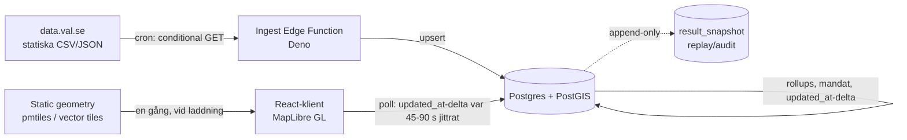

# Valvaka 2026 — dataanalys, stack & arkitektur

En realtidsvisualisering av valresultat per valdistrikt, byggd på data.val.se som
enda källa. Tänkt att passa din befintliga stack (React 18 + TS + Vite + Tailwind +
shadcn/ui, Supabase edge functions / Deno + Postgres).

---

## 1. Dataanalys

### 1.1 Källan: statiska filer, ingen live-API

Valmyndigheten exponerar **inget publikt streaming-/push-API**. Allt ligger som
platta filer på `data.val.se/filer/val<ÅÅÅÅ>/...` och uppdateras på schema. Den
löpande feeden till medierna är en separat, ej publik kanal. Slutsatsen för oss:
vi *pollar* statiska filer och bygger vår egen realtid ovanpå.

**URL-konventionen är stabil mellan val.** `data.val.se/filer/val2022/...` och
`data.val.se/filer/val2026/...` har identisk uppbyggnad (samma kataloger
`parti/`, `rostmottagning/`, samma filnamn `deltagande-partier.csv`,
`partisymboler.zip`, `kandidaturer.*`). Det betyder att 2026 års filnamn och
struktur går att förutsäga från 2022 — se §1.5.

> **⚠️ Korrigering (verifierat juli 2026):** källorna ligger på **två ställen** —
> anta inte att allt är under `data.val.se/filer/`:
> - **Parti-/röstmottagnings-CSV/JSON lever kvar på `data.val.se/filer/val2026/...`**
>   (t.ex. `parti/deltagande-partier.csv`, `parti/kandidaturer.csv`,
>   `rostmottagning/vallokaler.json`) — svarar 200, husstilen intakt (BOM, `;`, versala nycklar).
> - **Geometri-zip:arna och de flesta xlsx** ligger däremot som CMS-länkar på
>   `www.val.se/download/<opakt-id>/<ts>/<filnamn>` (den gamla `filer/`-sökvägen 404:ar för dem).
>
> Auktoritativt index som listar båda:
> [råvaru-sidan för val 2026](https://www.val.se/valresultat-och-statistik/statistik-och-data/radata-val-2026).
> `data.val.se` som helhet är numera en Angular-SPA; dess löpande valdata-JSON hämtas
> från `/assets/valtillfallen/<id>/valdata/...` (relevant för ingestion, Fas 3).

Bekräftade filer (val 2026):

| Fil | Innehåll | Uppdatering |
|-----|----------|-------------|
| `parti/deltagande-partier.csv` | Alla deltagande partier per valtyp/valområde | 1×/dygn |
| `parti/kandidaturer.csv` | Kandidaturer (kan vara flera per person) | 1×/timme, xx:40 |
| `parti/partisymboler.zip` | Partilogotyper, filnamn = partikod | statisk |
| `valdistrikt-riket-2026.zip` | Distriktsgeometri — **en enda GeoJSON** (~98 MB uppackad), **SWEREF99 TM / EPSG:3006**. Ren UTF-8, PascalCase-nycklar (`Valdistriktskod`…), numeriska koordinater — inte 2022 års husstils-fallgropar (§1.2). | statisk |
| `valdistrikt-hela-landet-2026.xlsx` | Samma utan koordinater | statisk |
| `...jamforelser-mellan-2022-och-2026.xlsx` | Jämförbarhetsmappning | statisk |
| *resultatfiler* | Preliminära + slutliga, mandat, personröster, valdeltagande | publiceras "vartefter" på valnatten/efter |

Resultatfilernas exakta schema för 2026 är inte publicerat ännu (resultat finns
inte). Modellera generiskt och verifiera mot den faktiska filen när den dyker upp —
men 2022 ger en mycket god mall (§1.5).

### 1.2 Format-fallgropar (verifierade mot 2022 års filer)

> **Scope:** dessa gäller val.se:s **CSV-/resultat-/kandidatfiler** (Fas 2–3) —
> verifierade mot 2022 och sannolikt oförändrade för 2026. Den nedladdade
> **distriktsgeometrin för 2026 är däremot ren** (GeoJSON, UTF-8 utan BOM,
> PascalCase-nycklar, numeriska koordinater, EPSG:3006) och behöver ingen av
> nedanstående normaliseringar — bara reprojicering (§6).

- **Avgränsare är `;`** trots filändelsen `.csv`.
- **UTF-8 med BOM** — strippa BOM före parsning.
- **Inledande nollor faller bort** om man läser naivt: `PARTIKOD` (4 siffror),
  `LISTNUMMER` (5 siffror). Läs *alla* koder som `string`, aldrig `number`.
- **Decimalkomma i koordinater.** I JSON-filerna är lat/long strängar med svenskt
  decimalkomma: `"LATITUD":"56,196602"`. Byt `,`→`.` före `parseFloat`.
- **Versala, svenska nyckelnamn** i både CSV-headers och JSON: `LÄNSKOD`,
  `VALDISTRIKTKOD`, `KOMMUNVALKRETSKOD`. Normalisera vid inläsning.
- Booleska fält är `J`/`N`/`I` (I = irrelevant), inte true/false.

### 1.3 Datamodellens kärna

**En join-nyckel överallt: `valdistriktskod`** — men den är *sammansatt*. Den
kanoniska 8-siffriga koden byggs som **länskod(2) + kommunkod(2) + distriktskod(4)**.
Exempel: län `10` + kommun `82` + `0512` = `10820512`. I vissa filer kommer delarna
i separata kolumner; sätt ihop nyckeln själv vid ingest, ta den aldrig rakt av från
en enskild kolumn. Vidare:

- *Valkrets skiljer sig per valtyp.* Ett distrikt har en riksdagsvalkrets, en
  regionvalkrets och en kommunvalkrets — olika koder. Aggregat måste alltid
  ske inom rätt valtyp.
- Hierarkin Riket → Län → Kommun → Valkrets → Valdistrikt. Alla högre nivåer är
  rena upprollningar; lagra bara distriktsnivå och aggregera i databasen.

**Jämförbarhet är inte 1:1.** Mappningen mot förra valet har flera fall:
oförändrad kod, *ej jämförbart* (0), eller jämförbart mot *flera* distrikt. Obs
schema-drift: 2022 års jämförelsefil tillät upp till **tre** 2018-koder
(`Kod 2`/`Kod 3`), medan 2026:s preliminära fil hittills nämner två. Designa för
N träffar, inte exakt två. Kriteriet för "jämförbart": gränsförändringen påverkar
≤5 % av distriktets röstberättigade. All "förändring sedan 2022"-logik måste hantera
detta — annars blir deltan fel just i de distrikt som ritats om (ofta de mest
intressanta).

**Resultatet muteras över tid, inte bara på kvällen:**

1. Valnatten: röster för partier som väntas ta mandat. Övriga buntas. Inga personröster.
2. Onsdagsräkningen (uppsamlingsdistrikt): sena förtidsröster → mandat kan flippa.
3. Länsstyrelsens sluträkning (~2 v): alla partier, personröster, fastställt resultat.

Designkonsekvens: resultattabellen är *append-tålig och idempotent*. En ny rapport
för ett distrikt **skriver över** den gamla (Valmyndighetens egen semantik), så
upsert på `(valtyp, valdistriktskod, partikod)` med `updated_at`.

### 1.4 Volym

~6 500 valdistrikt × 3 valtyper × ~10 räknade partier ≈ tiotusentals resultatrader.
Trivialt för Postgres. **Geometrin är det tunga** — riks-zip:en är 27 MB. Den ska
aldrig serveras rå till webbläsaren.

### 1.5 Vad 2022 säger om hur 2026 ser ut på valnatten

2022 års resultatsektioner ligger kvar publicerade, och 2026-sidan speglar redan
samma mall för de delar som hunnit fyllas i. Det går alltså att förutsäga
publiceringsstegen och artefakterna ganska exakt. Förväntad sekvens:

| Fas | 2022 års artefakt (mall för 2026) | Format / plats |
|-----|-----------------------------------|----------------|
| Preliminärt, valnatten | Riksdag "efter vallokalernas rösträkning" | XLSX, `www.val.se/download/...` |
| Preliminärt, ons/tors | Riksdag "inklusive uppsamlingsdistrikt" | XLSX |
| Röster per distrikt (prel.) | En fil **per valtyp** (RD/RF/KF) | XLSX, ~3–4 MB |
| Mandatfördelning | En fil, med jämförelse mot förra perioden | XLSX |
| Slutligt | Slutligt riksdagsresultat + röster/distrikt per valtyp | XLSX, ~14–19 MB |
| Personröster | Per valtyp, publiceras sent (i 2022: november) | XLSX, ~16–19 MB |

**Viktig nyans:** de nedladdningsbara resultatfilerna är **XLSX-kompileringar** på
`www.val.se/download/...` med ogenomskinliga ID:n — progressivt uppdaterade, men
inte en högfrekvent maskin-feed. De maskinvänliga, schemauppdaterade filerna
(`.csv`/`.json`) ligger i stället under `data.val.se/filer/val<ÅÅÅÅ>/...`. Den
exakta JSON som resultat.val.se-SPA:n pollar på *själva kvällen* är fortfarande
odokumenterad (se öppen punkt i §9), men dess form följer husstilen i §1.2
(versala svenska nycklar, strängkoder, decimalkomma).

---

## 2. Arkitektur i stort

Kärnprincipen: **klienterna rör aldrig val.se.** En enda ingestion-worker pollar
data.val.se, normaliserar till Postgres, och klienterna håller sig färska med en lätt
**inkrementell poll** (`updated_at`-delta, jittrad 45–90 s) mot Postgres. Det löser tre
problem samtidigt — CORS (val.se sätter knappast tillåtande headers), artighet mot källan
(en fetch i stället för N×klienter), och möjligheten att räkna mandat/deltan centralt en gång.

> **Uppdateringsväg: polling, inte Realtime (bytt 1 sep 2026).** Ursprungligen pushades
> `result`-ändringar via Supabase Realtime (websocket). Det togs bort: (a) Realtime/WAL
> logisk-decoding var den återkommande CPU-spiken på instansen, och (b) dess ≤100-rader-per-
> txn-gräns tvingade fram små edge-batchar som slog i edge:ns 2 s-CPU-tak på riks-RD-filen →
> filen markerades aldrig `done` → evig re-churn. Klienten pollar nu i stället en inkrementell
> `updated_at`-delta (self-heal-resyncen, ursprungligen backup, nu primär) — jittrat 45–90 s,
> bara synlig flik, refresh vid tab-fokus. Polling-lasten skalar med klienter/intervall, inte
> writes × prenumeranter. UX förblir "live" (staggrad tavel-reveal + pulsande indikator).



Notera att **geometrin går vid sidan om** databasflödet: distrikten är statiska och
laddas en gång som vektortiles, medan bara *resultatvärdenas delta* hämtas via klientens poll.

---

## 3. Ingestion-lagret (edge function, Deno, cron)

### 3.1 Schemaläggning

`pg_cron` + `pg_net` som anropar edge-funktionen, alternativt Supabase scheduled
functions. Två kadenser:

- **Förvalsperiod:** matcha källan — 1×/timme för parti/kandidat.
- **Valnatten:** tätare, t.ex. var 30–60:e sekund för resultatfilerna.

### 3.2 Var artig — conditional GET

Statiska filer bakom CDN stödjer rimligen `ETag`/`Last-Modified`. Spara validatorn
per fil i `ingest_state` och skicka en conditional GET. `304` → hoppa över parsning
helt. Lägg på exponentiell backoff vid fel, och en jitter så att inte varje cron-tick
träffar samtidigt.

> **⚠️ Verifierat mot val.se (juli 2026):** ETag returneras men **honoreras inte** —
> `If-None-Match` ger `200`. **`If-Modified-Since` (Last-Modified) ger `304`** och är
> mekanismen att använda. `ingest_state` driver därför skip på `last_modified`; `etag`
> sparas bara för audit. Faller Last-Modified någon gång bort → fallback är
> body-hash i `ingest_state`. Se `supabase/functions/ingest-parti/index.ts` (Fas 3).

### 3.3 Parsning

```ts
// Deno edge function (skiss)
const res = await fetch(url, {
  headers: etag ? { "If-None-Match": etag } : {},
});
if (res.status === 304) return { skipped: true };

let text = await res.text();
if (text.charCodeAt(0) === 0xFEFF) text = text.slice(1); // strip BOM

const rows = parse(text, { separator: ";", header: true }); // koder som string

// normalisering av val.se-husstilen:
const num = (s: string) => parseFloat(s.replace(",", ".")); // decimalkomma
const vdk = (r: Row) => r.LÄNSKOD + r.KOMMUNKOD + r.VALDISTRIKTKOD; // 8-siffrig nyckel
// upsert i batch via supabase-js / postgrest, eller COPY till staging
```

Pipeline per körning: hämta → strippa BOM → parsa `;` → normalisera
(decimalkomma, sätt ihop valdistriktskod, behåll nollor) → upsert till `staging_*`
→ MERGE in i normaliserade tabeller → trigga aggregat-refresh.

---

## 4. Postgres-schemat

```sql
-- Statiska referenstabeller (laddas en gång före valet)
create table party (
  partikod      text primary key,         -- '1325', behåll nollor
  beteckning    text not null,
  forkortning   text,
  color         text                       -- hex för choropleth
);

create table district (
  valdistriktskod text primary key,         -- 8 siffror: län+kommun+distrikt
  namn            text not null,
  kommunkod       text not null,
  lanskod         text not null,
  vk_rd           text,                     -- riksdagsvalkrets
  vk_rf           text,                     -- regionvalkrets
  vk_kf           text,                     -- kommunvalkrets
  geom            geometry(MultiPolygon, 4326)  -- reprojicerad från SWEREF99 TM
);

-- Jämförbarhet mot förra valet (0..N träffar; 2022 hade upp till 3)
create table district_comparison (
  valdistriktskod text primary key references district,
  jamforbarhet    text not null,            -- 'JA' | 'NEJ' | 'FLERA'
  koder_foreg     text[]                    -- array, inte fasta kolumner
);

-- Resultat — idempotent, muteras över tid
create table result (
  valtyp          text not null,            -- 'RD' | 'RF' | 'KF'
  valdistriktskod text not null references district,
  partikod        text not null references party,
  roster          integer not null,
  andel           numeric(6,3),
  updated_at      timestamptz not null default now(),
  status          text not null,            -- 'preliminar' | 'onsdag' | 'slutlig'
  primary key (valtyp, valdistriktskod, partikod)
);

-- Append-only logg för replay & granskning ("spola tillbaka kvällen")
create table result_snapshot (
  id              bigint generated always as identity,
  ingest_ts       timestamptz not null default now(),
  valtyp          text not null,
  valdistriktskod text not null,
  partikod        text not null,
  roster          integer not null
);

create table ingest_state (
  file_path text primary key,
  etag      text,
  last_ok   timestamptz
);
```

Aggregat (kommun/län/rike, valdeltagande, vinnande parti) som materialiserade vyer
eller `result`-triggade summeringstabeller. Mandatberäkningen (se §5) körs som
funktion efter varje rikstäckande refresh.

> `koder_foreg` som `text[]` i stället för `kod1/kod2/kod3`: 2022 visade att antalet
> jämförbara föregående distrikt varierar (0–3). En array slipper schemaändring om
> 2026 introducerar fler.

### 4.1 Delta mot förra valet

Joina `result` (2026) mot en `result_foreg`-tabell **via `district_comparison`**,
inte direkt på koden. Hantera `FLERA` genom att summera alla distrikt i
`koder_foreg`; markera `NEJ`-distrikt som "ingen jämförelse" i UI:t i stället för
att visa en missvisande nolla.

---

## 5. Mandatberäkning (eget modulansvar)

Sverige använder **jämkade uddatalsmetoden** (modifierad Sainte-Laguë, första
divisor 1,2). Riksdagen: 349 mandat = 310 fasta valkretsmandat + 39
utjämningsmandat, spärr 4 % i riket (eller 12 % i en valkrets). Region/kommun har
egna spärrar och egen utjämning.

Två skäl att isolera detta i en egen modul (Postgres-funktion eller Deno):

1. Utjämningsmandaten kräver **rikstäckande** aggregat — kan inte räknas förrän
   tillräckligt många distrikt rapporterat. Den preliminära mandatfördelningen på
   kvällen är just preliminär och flippar.
2. Spärrar och divisorer skiljer per valtyp. Håll dem som konfig, inte hårdkodat.

Behandla nattens mandat som en *projektion* med tydlig "preliminärt"-flagga i UI.

---

## 6. Geometri-pipeline (engångs, före valet)

> **Genomförd som ren offline-JS, INTE i DB:n.** Stegen nedan beskrevs
> ursprungligen med PostGIS (`ST_Transform`/`ST_Simplify`), men implementationen
> gör hela kedjan i `mapshaper` (`scripts/build-geometry.mjs`) och skriver en
> statisk GeoJSON — ingen tabell har geom-kolumn. PostGIS-extensionen droppades
> därför ur databasen 2026-08-04 (migration `…_drop_postgis`): den var oanvänd
> och exponerade `spatial_ref_sys` via PostgREST (Supabase RLS-advisory). Behövs
> DB-sidig geometri i framtiden → `create extension postgis with schema extensions`
> (aldrig i `public`).

1. Ladda läns-zip:arna. Källa för distriktsgränser: **SWEREF99 TM = EPSG:3006**.
   (Obs att vissa andra val.se-filer, t.ex. vallokaler.json, redan är i WGS84 med
   decimalkomma — koordinatsystem skiljer per fil, anta inget.)
2. Reprojicera till **WGS84 = EPSG:4326** (`ST_Transform` i PostGIS, eller proj4
   vid förbearbetning).
3. **Förenkla** — `ST_SimplifyPreserveTopology`. 6 500 fullupplösta MultiPolygons
   är ospelbart i webbläsaren.
4. Generera **vektortiles** (pmtiles via tippecanoe, eller pg_tileserv/Martin från
   PostGIS). Serva som statisk asset, inte per-request genom DB:n.
5. Klienten laddar tiles en gång; bara `result`-värdena flödar sedan i realtid och
   joinas mot tile-features på `valdistriktskod` i kartans paint-uttryck.

TopoJSON är ett enklare alternativ om du vill slippa tile-servern, men pmtiles
skalar bättre för rikstäckande zoom.

---

## 7. Frontend (din stack)

- **MapLibre GL JS** framför Leaflet — datadriven styling på 6 500 polygoner med
  `fill-color` som `match`/`interpolate`-uttryck på partikod/marginal, plus en
  "just inrapporterad"-puls. Leaflet orkar inte detta lika smidigt.
- **Klient-polling (inte Realtime)**: klienten hämtar en inkrementell `updated_at`-delta
  var 45–90 s (jittrat) via samma self-heal-resync som annars bara läkte Realtime-släpning
  — nu **primär** uppdateringsväg. Bara synlig flik pollar; refresh vid tab-fokus. Deltan
  appliceras genom per-distrikt-listeners → kartan gör rAF-koalescerad ompaint, tavlan
  staggrar in nya distrikt. Kräver index `(valtyp, updated_at)` så deltan blir en index-
  range-scan, inte tabellscan. (Realtime togs bort 1 sep — se §2.)
- **Departure board-känsla**: en ticker över inrapporterade distrikt (du har redan
  mönstret från avgångstavlorna i transit-appen) — återanvänd.
- Drill-down rike → län → kommun via aggregat-vyerna; recharts för stapeldiagram /
  mandatprojektion.
- Skicka aldrig 27 MB GeoJSON till klienten (se §6).

---

## 8. Operativa hänsyn för valnatten

- **Idempotens:** re-rapport skriver över. Upsert, aldrig insert-append i `result`.
- **Replay:** `result_snapshot` (append-only) gör att du kan spola tillbaka kvällen
  och felsöka i efterhand — och är en hederlig revisionslogg.
- **Långsam mutation:** designa för att resultatet ändras i dagar (onsdagsräkning,
  sluträkning, personröster sent). Status-fältet (`preliminar`/`onsdag`/`slutlig`)
  styr UI-märkning.
- **Källans ojämnhet:** distrikt droppar in i klungor, inte jämnt. Visa
  rapporteringsgrad ("X av Y distrikt räknade") prominent — det är den siffra som
  kalibrerar tilltron till mandatprojektionen.
- **Verifiera resultatschemat live:** den första riktiga resultatfilen kan ha
  kolumner du inte förutsett. Ha en staging-tabell med lös typning som buffert.

---

## 9. Föreslagen byggordning

1. **Geometri först** (statiskt, kan göras nu): ladda, reprojicera, förenkla,
   tiles. Rendera en tom karta över alla distrikt.
2. **Referensdata**: `party` + `district` + `district_comparison` från de redan
   publicerade filerna.
3. **Ingestion mot parti/kandidat-CSV** (finns nu) — verifiera poll, ETag,
   BOM/`;`/nollor/decimalkomma/nyckelbygge end-to-end mot riktig data.
4. **Resultatschema + mandatmodul** mot historisk 2022-data som stand-in tills
   2026-filerna finns (se §10).
5. **Kart-paint via poll** — klienten pollar `result`-deltan (`updated_at`) och animerar
   inrapporteringen. (Ursprungligen Realtime-push; bytt till polling 1 sep — se §2.)
6. **Generalrep** på 2022-datan uppspelad genom snapshot-tabellen som om det vore
   live (§10).

> Öppen punkt: den exakta JSON-endpoint som resultat.val.se-SPA:n pollar på själva
> kvällen är inte publikt dokumenterad. Fånga den via DevTools → Network under en
> testkväll/generalrep, eller arbeta mot de nedladdningsbara resultatfilerna på
> `data.val.se/filer/val2026/...` när de börjar publiceras.

---

## 10. 2022-replay-harness (generalrep mot riktig data)

Det starkaste sättet att testa hela kedjan före valnatten: 2022 års "röster per
distrikt"-filer (preliminära **och** slutliga, per valtyp) är **nedladdningsbara
redan nu**. Du kan därför spela upp en *riktig* valnatt genom din pipeline.

**Vad du har att jobba med från 2022:**

- `.../preliminart-roster-per-distrikt-riksdagsvalet-2022.xlsx` (~3 MB) och
  motsvarande för region- och kommunval.
- Slutliga `Roster-per-distrikt-slutligt-antal-roster-...`-filer per valtyp
  (~14–19 MB), inkl. totalt valdeltagande.
- Jämförelse- och mandatfiler för att validera delta- och mandatmodulen mot
  Valmyndighetens egna facit.

**Harness-design:**

1. **Konvertera** XLSX → normaliserade rader `(valtyp, valdistriktskod, partikod,
   roster)`. Bygg den 8-siffriga nyckeln, behåll nollor, hantera decimalkomma.
2. **Syntetisera en inrapporteringsordning.** Den preliminära filen saknar
   tidsstämplar per distrikt, så generera en plausibel sekvens — t.ex. slumpa fram
   distrikt i klungor, eller vikta så att små/tätorts-distrikt droppar tidigare,
   för att efterlikna verklig ojämnhet.
3. **Driv klockan.** En `replay_clock` matar in distrikt i `result_snapshot` +
   `result` i den ordningen, i komprimerad tid (t.ex. 3 timmar → 3 minuter), så att
   klientens poll-delta, kart-paint och mandatprojektion triggas precis som skarpt.
4. **Validera mot facit.** När alla distrikt matats in ska dina aggregat och
   mandatberäkning matcha 2022 års slutliga mandatfil exakt. Det är ett skarpt
   regressionstest för hela ingest→aggregat→mandat-kedjan.

```ts
// replay-skiss (Deno-script eller edge function i 'replay'-läge)
const rows = loadXlsx("preliminart-roster-per-distrikt-riksdagsvalet-2022.xlsx");
const order = syntheticReportingOrder(rows);     // klungor, viktat på storlek
for (const batch of order) {
  await ingestBatch(batch);                       // samma kod som skarp ingest
  await sleep(compressedInterval);                // komprimerad valnatt
}
assertMandatesMatch("slutligt-valresultat-riksdagen-2022");
```

Poängen: replay-läget delar *exakt* samma ingest-, aggregat- och mandatkod som
skarp drift — bara källan (lokal XLSX i stället för poll mot data.val.se) och
klockan skiljer. Då testar generalrepet rätt sak.
